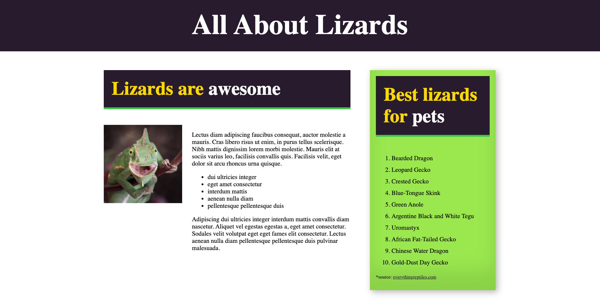

# Lizard Page

Although this was a fairly simple page to tackle, it really helped me understand how display flex works and how to properly set up my html elements in order to style it correctly. Display flex turns its direct children elements into columns and working on this page really helped solidify the steps needed to take in order to manipulate content the way I want to display them.